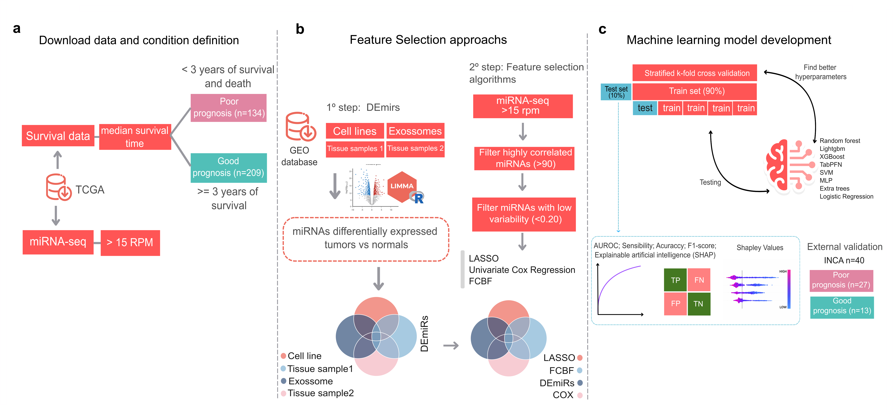

[](https://doi.org/10.5281/zenodo.17360240)


# miRNA-based Machine Learning Model for Risk Stratification in High-Grade Serous Ovarian Cancer


[](https://creativecommons.org/licenses/by/4.0/)

> **Cristiane Esteves, M.Sc** — Bioinformatics and Computational Biology Laboratory (LBBC)  
> Brazilian National Cancer Institute (INCA-RJ) | [LBBC team](https://sites.google.com/view/bioinformaticainca-en/home-en)  
> ✉️ cristiane.esteves@ensino.inca.gov.br

---

## Overview

This repository contains the full analysis pipeline for the study:

**"miRNA-based machine learning model stratifies risk in high-grade serous ovarian cancer: a retrospective cohort study"**

Ovarian cancer, particularly the High-Grade Serous Ovarian Carcinoma (HGSOC) subtype, is the most lethal gynecological malignancy, mainly due to late-stage diagnosis and limited prognostic biomarkers. This study identifies and validates a prognostic miRNA signature combined with clinical variables using interpretable machine learning.

The trained model integrates **10 miRNA biomarkers** and **3 clinical variables** to classify patients as **Good** or **Poor** prognosis, with survival analysis supporting its independent prognostic value.

---

## Workflow



---

## Repository Structure

```
Repository Structure
prognosis_Predictor_miRNA/
│
├── Notebooks/
│   └── ovarian_cancer_external_validation.ipynb   # External validation notebook - results (HTML)
│
├── data/
│   ├── Overall_Survival_(months).txt        # Overall survival data (TCGA-OV)
│   ├── README.md                            # Data description
│   ├── fig2.RData                           # Pre-processed objects for Figure 2 (R)
│   ├── fig4.RData                           # Pre-processed objects for Figure 4 (R)
│   
│
├── scripts/
│   ├── README.md                            # Scripts description
│   ├── fig2.Rmd                             # Figure 2: KM curves, UpSet, correlation matrix
│   ├── fig4.Rmd                             # Figure 4: miRNA–target interaction networks, exosome enrichment analyses, and pathway enrichment visualizations.
│   ├── ml_pipeline_miRNA_clinical.py        # Full ML training pipeline (RFE + GridSearch)
│   └── prepare_miRNAisoform_prognosis_dataset.R  # miRNA isoform preprocessing script
│
├── requirements.txt                         # Python dependencies
├── figure1.png                              # Pipeline workflow diagram
└── README.md
```

---

## Data

### Training cohort — TCGA-OV (public)

Training data derives from the publicly available The Cancer Genome Atlas ovarian cancer cohort (TCGA-OV). Batch-effect corrected miRNA isoform expression data were obtained from the GSE164767 dataset, while corresponding clinical data were retrieved from cBioPortal for Cancer Genomics.

**Cohort**: High-grade serous ovarian carcinoma (HGSOC) patients from the The Cancer Genome Atlas ovarian cancer cohort (TCGA-OV), with batch-effect corrected miRNA isoform expression data from GSE164767 and matched clinical annotations

**Target**: Overall survival prognosis (Poor: death before 3 years vs Good: survival ≥ 3 years)

**miRNA quantification**: Normalized miRNA isoform expression values in CPM/RPM scale (median RPM > 15 filter applied)

**Clinical variables**: Age at diagnosis, FIGO stage, and CA-125 expression (MUC16)


## Required Input Features

### miRNA features — 10 biomarkers

Column names must **contain** the following substrings. Values must be in **CPM** scale:

| Pattern | Example column name |
|---|---|
| `187` | `hsa_mir_187` |
| `149` | `hsa_mir_149` |
| `205` | `hsa_mir_205` |
| `150` | `hsa_mir_150` |
| `143` | `hsa_mir_143` |
| `485` | `hsa_mir_485` |
| `200a` | `hsa_mir_200a` |
| `23a` | `hsa_mir_23a` |
| `106b` | `hsa_mir_106b` |
| `151a` | `hsa_mir_151a` |

### Clinical features — 3 variables

| Column | Type | Preprocessing required |
|---|---|---|
| `age_at_index` | float | None |
| `figo_stage` | int | None (values 1–4) |
| `MUC16` | float | **Log2-transform:** `log2(raw_CA125 + 1)` |

### Target variable encoding

| Label | Value |
|---|---|
| Poor prognosis | `1` |
| Good prognosis | `0` |

---

## Installation

### 1. Clone the repository

```bash
git clone https://github.com/bioinformatics-inca/prognosis_Predictor_miRNA.git
cd prognosis_Predictor_miRNA
```

### 2. Set up Python environment

```bash
conda create -n mirna_prognosis python=3.9
conda activate mirna_prognosis
pip install -r requirements.txt

---

## Reproducing the Analysis

Run in the following order:

### Step 1 — Train the model (Python)
```bash
python scripts/ml_pipeline_miRNA_clinical.py
```

```
Raw input features
    └── 1. Scaler      → RobustScaler or StandardScaler (or passthrough)
    └── 2. Sampler     → SMOTE / RandomOverSampler / RandomUnderSampler (or passthrough)
    └── 3. RFE         → Recursive Feature Elimination (LogisticRegression base, C=0.01)
    └── 4. Classifier  → Best model selected by GridSearchCV
    └── 5. Calibration → Platt scaling (sigmoid), 3-fold CV
```

**Outputs:**
- `model.pkl` — best model (by internal AUC)
- `results_final_RFE.csv` — full results table with all metrics and CIs
- Full metrics with 95% CI printed to console

---

**Key methodological decisions:**
- Threshold tuned on out-of-fold probabilities to prevent data leakage
- Probability calibration: Platt scaling (sigmoid), 3-fold internal CV
- Feature selection: RFE with LogisticRegression (C=0.01), sweeping 3–13 features
---

## Citation

If you use this code or model in your research, please cite:
The Lancet Health Americas [DOI]

---

## License

This project is licensed under the **Creative Commons Attribution 4.0 International (CC BY 4.0)**.  
You are free to share and adapt the material for any purpose, provided appropriate credit is given.  
🔗 [https://creativecommons.org/licenses/by/4.0/](https://creativecommons.org/licenses/by/4.0/)

---

## Contact

**Cristiane Esteves, M.sC**  
Bioinformatics and Computational Biology Laboratory (LBBC-INCA)  
Brazilian National Cancer Institute — Rio de Janeiro, Brazil  
✉️ cristiane.esteves@ensino.inca.gov.br  
🌐 [LBBC-INCA](https://sites.google.com/view/bioinformaticainca-en/home-en)

